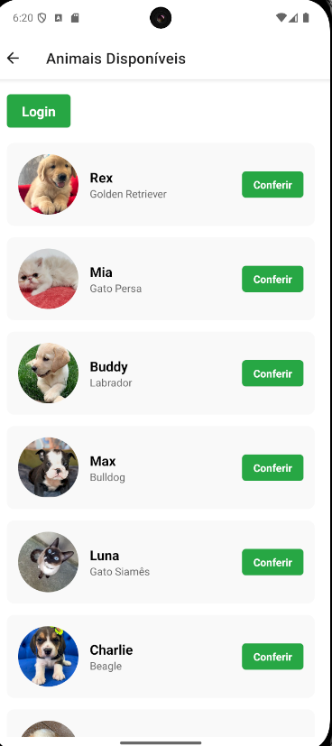
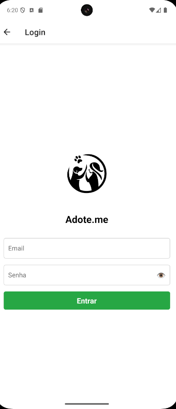
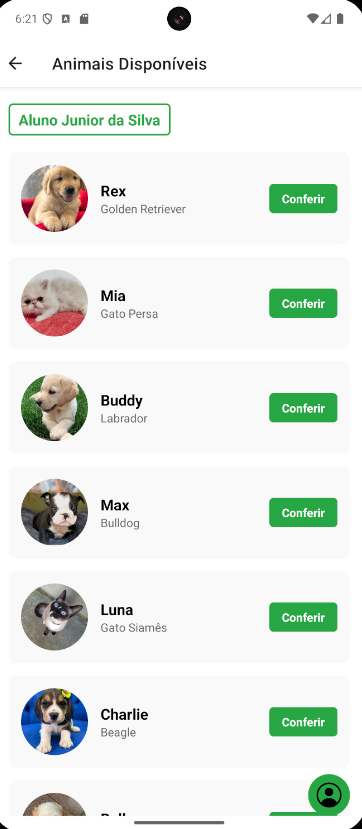
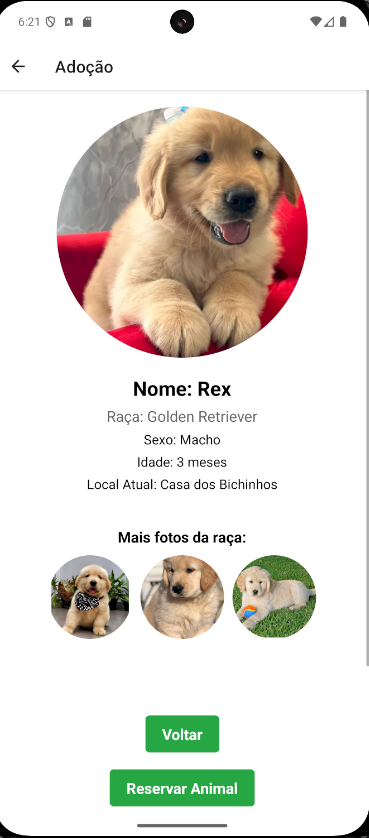
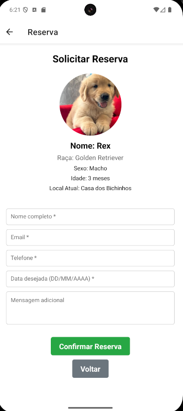
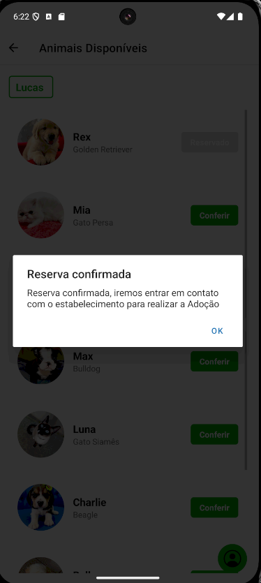
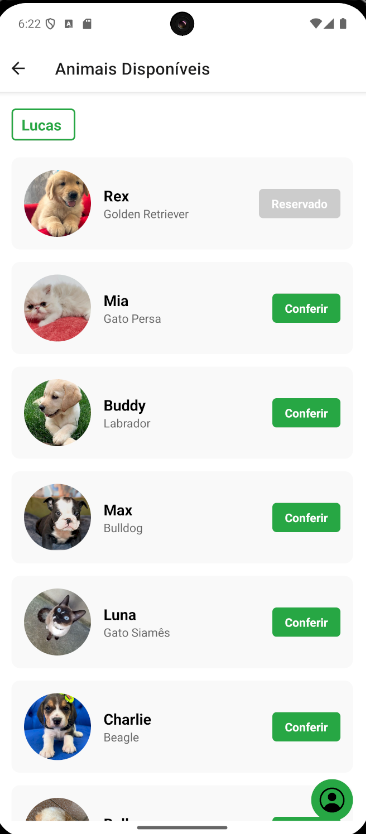
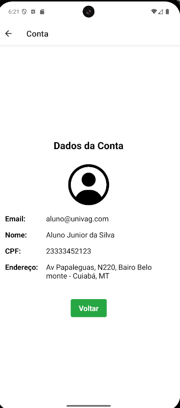

# Adote.me

## Contextualização

O Adote.me é um aplicativo móvel desenvolvido em React Native com Expo, destinado a facilitar a adoção de animais de estimação. O objetivo principal é conectar pessoas interessadas em adotar animais com aqueles disponíveis para adoção, promovendo a responsabilidade e o cuidado com os pets. O app resolve o problema de falta de visibilidade e acessibilidade para adoções, permitindo que usuários visualizem animais disponíveis, façam login para acessar funcionalidades avançadas como adoção e reserva, e gerenciem suas contas.

## Como Rodar

### Pré-requisitos
- Node.js instalado (versão 14 ou superior).
- Expo CLI instalado globalmente: `npm install -g @expo/cli`.
- Um dispositivo móvel ou emulador para testar o app.

### Instruções Passo a Passo
1. Clone o repositório ou navegue até o diretório do projeto: `cd c:/Users/lpmc2/Documents/Projetos/unimaps/app2`.
2. Instale as dependências: `npm install`.
3. Inicie o servidor Expo: `npm start` ou `expo start`.
4. Escaneie o QR code com o app Expo Go no seu dispositivo móvel, ou execute no emulador/simulador.
   - Para Android: `npm run android`.
   - Para iOS: `npm run ios`.
   - Para web: `npm run web`.

## Como Utilizar

### Navegação Principal
- **Tela Inicial (Home)**: Exibe o logo e botões para "Conferir Animais" (leva à lista sem login) e "Login".

- **Lista de Animais (AnimalList)**: Mostra animais disponíveis com opções para adotar ou reservar. Requer login para ações.

- **Login**: Use email 'aluno@univag.com' e senha '123456' para logar como usuário de exemplo. Ao realiza-lo, retorna a tela de Animais Disponíveis.

- **Adoção (AdoptionScreen)**: Confirma a adoção de um animal selecionado.

- **Reserva (ReservationScreen)**: Permite reservar um animal preenchendo formulário com dados pessoais. Após a reserva aparece uma mensagem para o usuário confirmando a reserva e redireciona o mesmo para a tela de Animais Disponíveis.

- **Conta (AccountScreen)**: Exibe informações do usuário logado.

### Funcionalidades Principais
- **Visualizar Animais**: Na tela AnimalList, veja detalhes como nome, espécie, idade e descrição.
- **Adotar**: Clique em "Adotar" em um animal; confirme na tela de adoção. O animal fica indisponível.
- **Reservar**: Clique em "Reservar"; preencha o formulário na tela de reserva.
- **Gerenciar Conta**: Após login, acesse a conta para ver dados pessoais.

